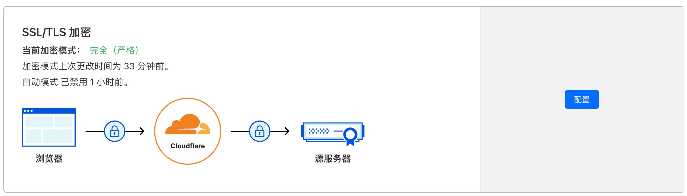

[[toc]]


# Cloudflare Tunnel

前端开发中经常会遇到在手机 App 打开 WebView 来访问网页的情况，一些 App 的生产版本对访问的地址有比较严格的限制，比如不支持本地局域网、仅支持 HTTPS 访问等。对以上情况，我们可以使用 `Cloudflare Tunnel` 来突破这个限制。

## Tunnel原理
::: tip
`Tunnel` 的原理是在本地启动一个 `cloudflared` 进程，创建一个从 `cloudflare edge` 到本地 `server` 的通道。这样访问者就可以通过 `edge` 来访问本地服务了。
:::

## 开通服务

### 添加域名
::: tip
首先，需要确保你在 `Cloudflare` 下有可管理的域名,并且已经解析DNS记录。然后在`Cloudflare`主页 有个输入现有域名，输入你的域名就行，我这里用的是阿里的域名，按照页面提示开通
:::

### 更改DNS解析
::: tip
将原来域名的解析更改为`Cloudflare`提供的`DNS`,我这里用的是阿里的域名，就需要去阿里的控制台修改域名对应的`DNS`，修改好之后，阿里这边一般要1-5分钟生效。`Cloudflare`会再慢一点，大概7-8分钟左右。
:::

### 等待DNS解析生效
::: tip
修改好`DNS`之后，阿里这边一般要1-5分钟生效。`Cloudflare`会再慢一点，大概7-8分钟左右。在`Cloudflare`这边看到你添加的域名状态为`活动`时，就说明正常生效了，可以进行第4项，配置`cloudflared`了
:::

## 安装 cloudflared
::: tip
参考官方文档 https://developers.cloudflare.com/cloudflare-one/connections/connect-networks/downloads/ 在你的操作系统下安装 `cloudflared`。MacOS 下直接使用 brew 进行安装。
```shell
brew install cloudflared
```
:::

## 配置 cloudflared
::: tip 
安装完成之后，在本地命令行内进行登录操作。
```shell
cloudflared login
```
自动弹出浏览器页面，选择你的域名并授权，按照提示进行下一步操作（关闭浏览器，回到终端）。
:::

## 创建 Tunnel


::: tip
`Tunnel` 可以取任意名称，这里创建一个叫做 `mobiletest` 的 `Tunnel`。
```shell
cloudflared tunnel create mobiletest
```
:::

## 创建 Route
::: tip 
使用下面的命令创建一个 `dns route`，这个命令创建一个 `DNS CNAME`，指向 `mobiletest Tunnel`。
```shell
cloudflared tunnel route dns mobiletest mobiletest.your.domain
```
:::

## 启动 Tunnel
::: tip
先在本地启动想要外网可以访问的服务，然后使用 `tunnel run` 启动 `mobiletest Tunnel`，使用 --url 参数将 `Tunnel` 连接到本地服务。
```shell
cloudflared tunnel run --url http://localhost:3000 mobiletest
```
接下来，打开浏览器，输入前面创建的 `CNAME` 地址 `mobiletest.your.domain` 就可以加载本地服务了。
:::

## 遇到的问题
### 开通完服务DNS生效后，域名对应网站301
::: tip
点击到对应的域名中，左边侧边栏选择`SSL/TLS`设置,进入之后,看下当前的加密模式是不是 `完全(严格)`,如果不是，需要点击右边的配置更改为`完全(严格)`，不然就会导致一直301重定向
<div align=center>
    
</div>
:::