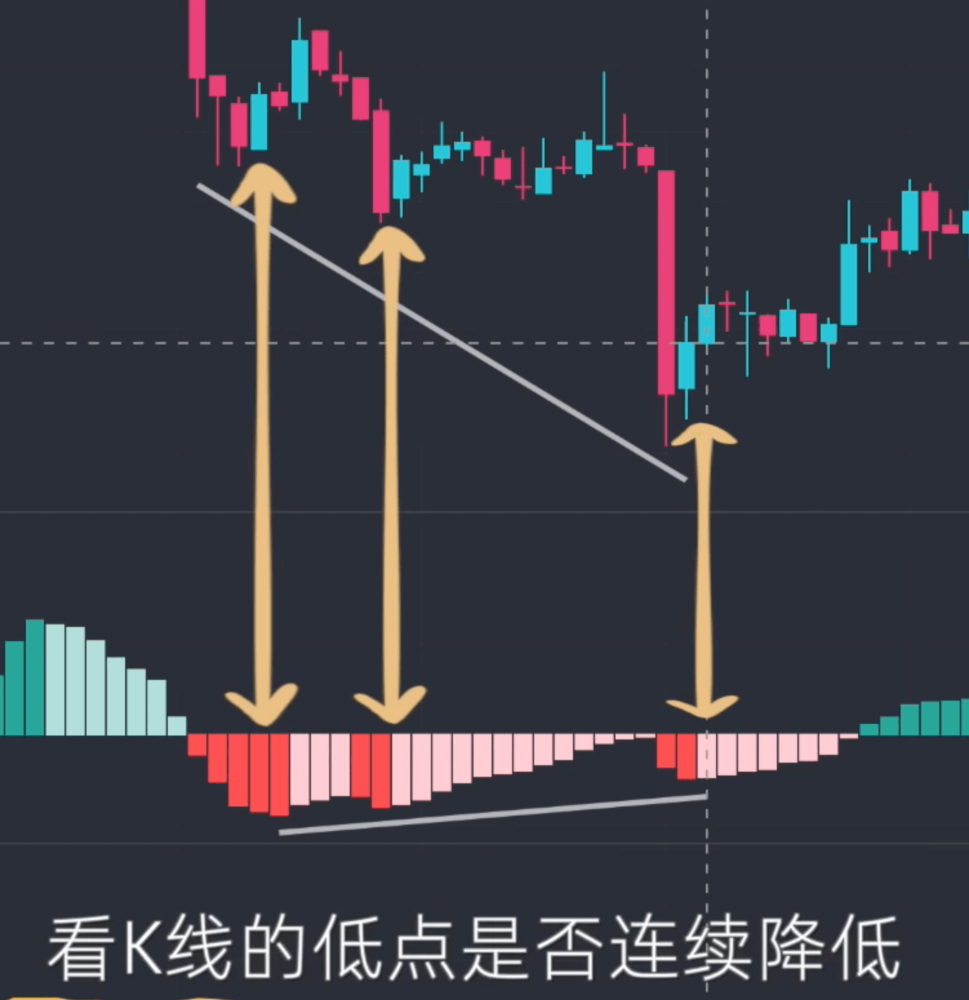
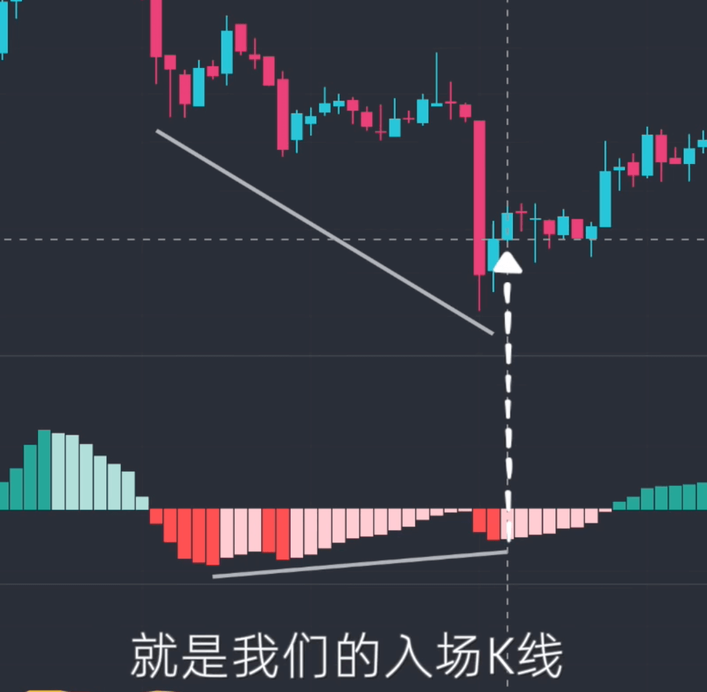
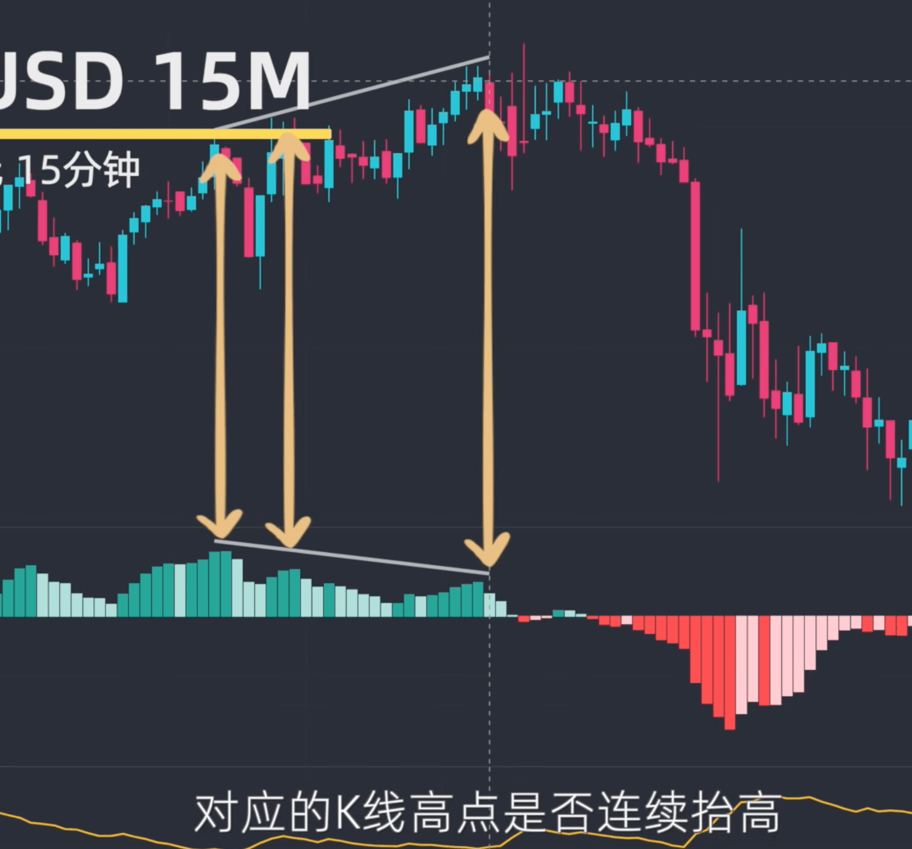
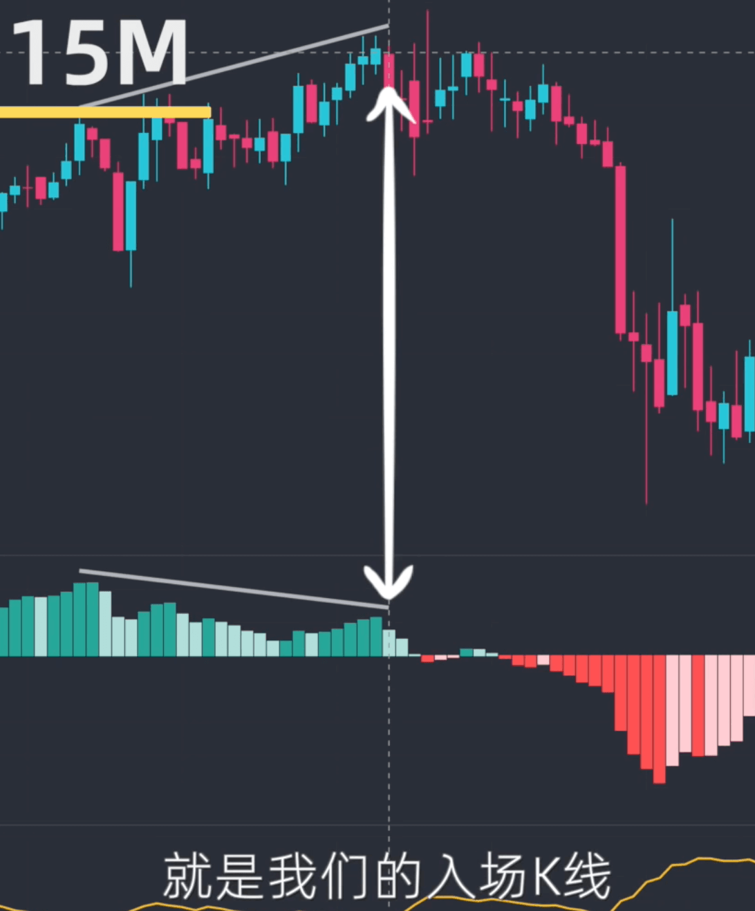

[[toc]]
# macd + ATR 背离策略
[详解可参考youtube的解析](https://www.youtube.com/watch?v=Ic8V1Pue-2I)

::: tip macd指标设置
打开`TradingView`，添加如下指标
`macd`:顶部导航栏指标，添加`macd`指标，设置`快线13`,`慢线34`

`ATR` :顶部导航栏指标，添加`ATR`指标，设置`长度13`
:::

::: tip 多单 
1、`零线下方macd柱状图连续升高`：找到零线 `下方` 两个或三个 `波峰` 相差较大且`连续升高`的`MACD`柱状图
2、`对应的K线的低点连续降低`：再看连续升高的`MACD`柱状图对应的`K线的低点`是否`连续降低`

入场位置：以上两条件都满足，则`macd`实心柱转为虚心柱的第一根K线,就是我们的入场K线

`多单止损位`：`入场K线的低点` - `ATR`数值 就是`多单`的止损位

    
    

:::

::: tip 空单
1、`零线上方macd柱状图连续降低`：找到零线 `上方` 两个或三个 `波峰` 相差较大且`连续降低`的`MACD`柱状图
2、`对应的K线的高点连续升高`：再看连续降低的`MACD`柱状图对应的`K线的高点`是否`连续升高`

入场位置：以上两条件都满足，则`macd`实心柱转为虚心柱的第一根K线,就是我们的入场K线

`空单止损位`：`入场K线的高点` + `ATR`数值 就是`空单`的止损位

:::
